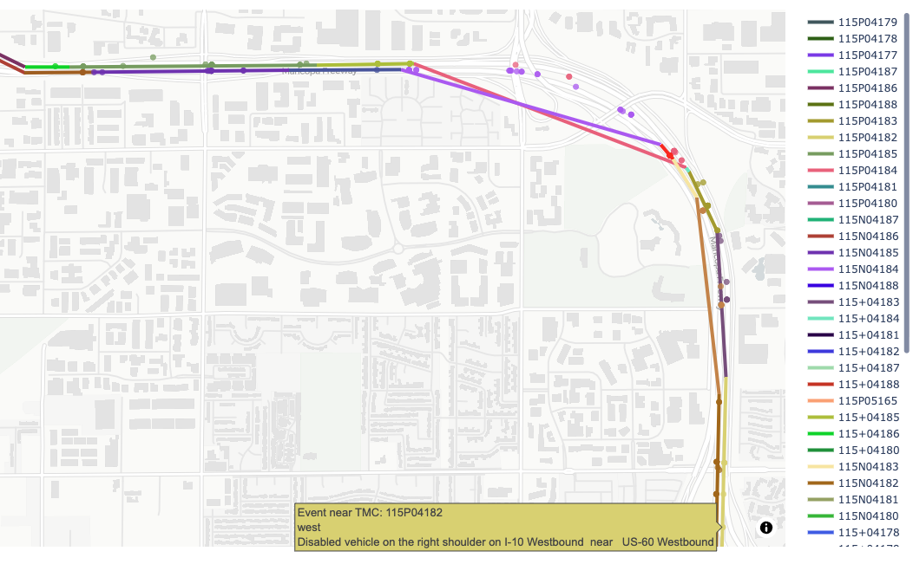
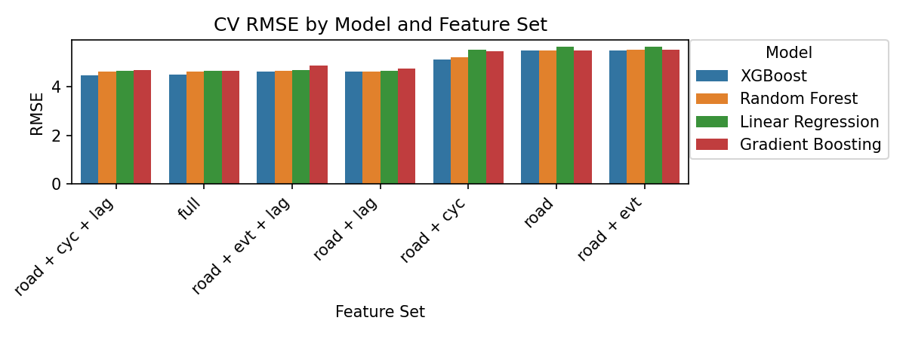
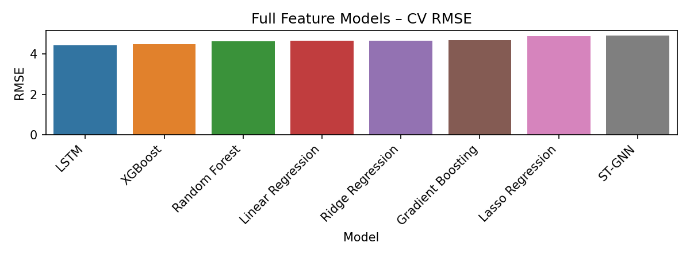
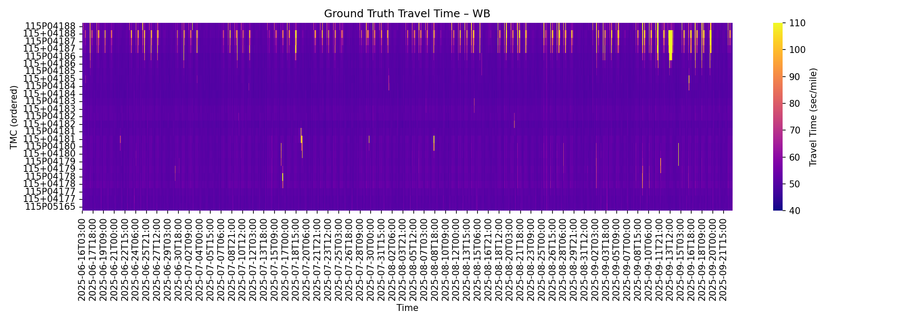
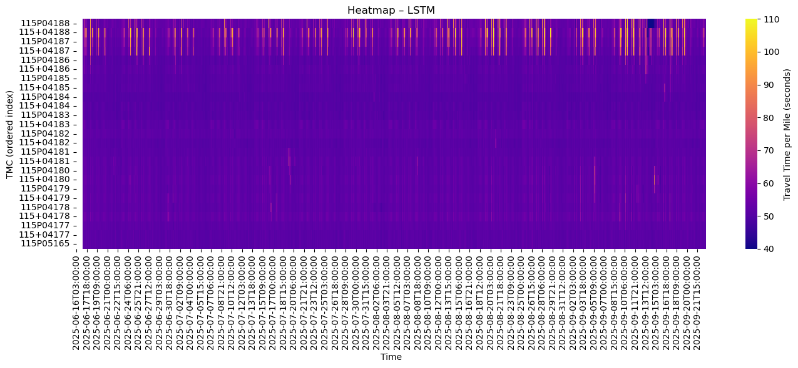
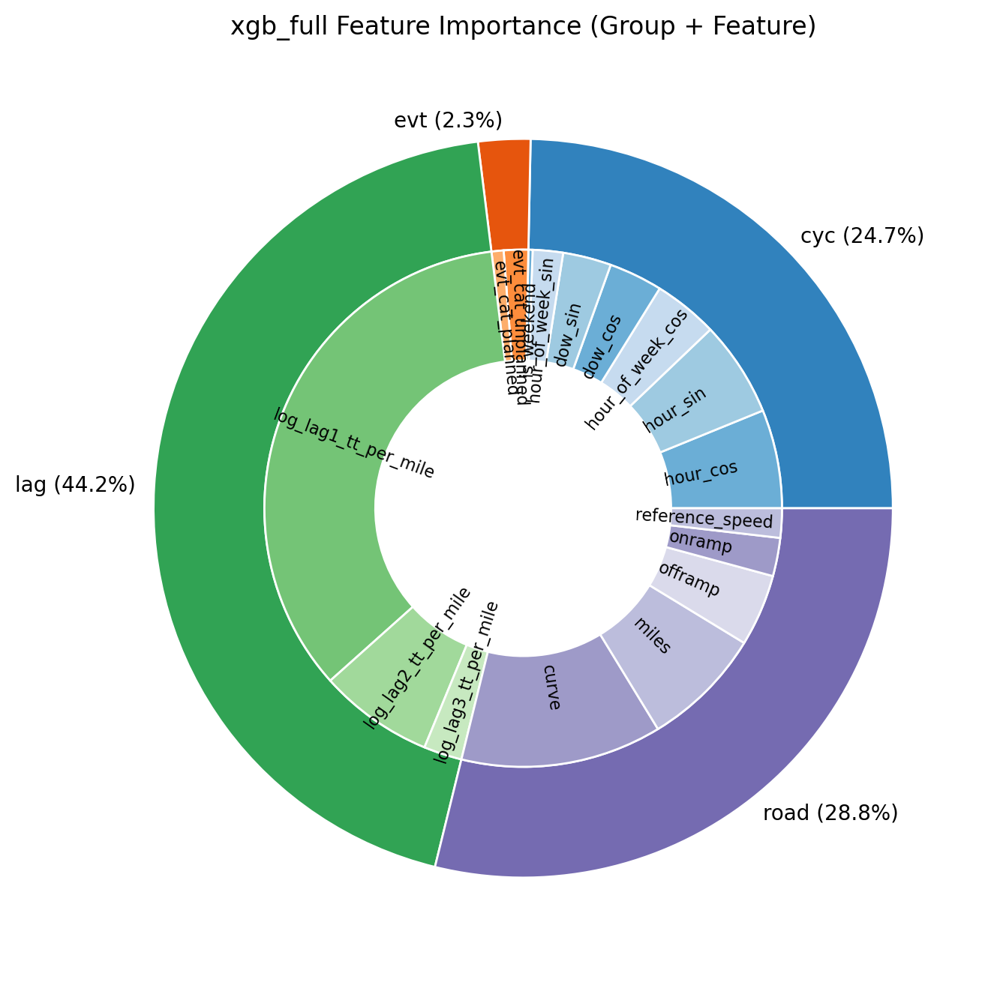

# Traffic Prediction on I-10 in Phoenix, AZ

Author: Yanbing Wang

The goal of this project is to predict the travel time on I-10 given historical traffic data and (near) real-time work zone schedules and incident information.


### Questions
- How to predict short-term (30 sec to 5 min) traffic (speed on each road segment) on a freeway corridor, given historical traffic speed data?
- How do planned (e.g., work zones) and unplanned (e.g., crashes) events affect short-term traffic delay? 
- Does integrating these events improve short-term traffic prediction accuracy?

#### Study Area: I-10 Broadway Curve: 11-mile stretch between Loop 202 and I-17


*Matched events to the nearest TMC segment per direction*

## Quick Start

Run the pipeline end-to-end with these scripts. Each command shows where outputs are written.

1) Prepare the dataset (events + INRIX -> parquet), save training data to `database/i10-broadway/X_full_1h.parquet` – final feature table with MultiIndex (tmc_code, time_bin)

```bash
python prepare_i10_training_data.py 
```


2) Train tabular baselines (Linear/Ridge/Lasso, RF/GBRT, XGBoost), save models to `models/tabular_run`

```bash
python train_model_tabular.py --save-models
```

3) Train LSTM (sequence model), save to `models/lstm_run`

```bash
python train_model_lstm.py --save-models
```

4) Train ST‑GNN (GCN + LSTM), save to `models/gcn/gcn_lstm_i10_wb`

```bash
python train_model_stgnn.py 
```

5) Compare models and generate figures, save to images/

```bash
python model_comparison.py --direction WB --save-figs
```
6) Counterfactual analysis to estimate the impact of planned events on travel time, save to images/

```bash
python evt_impact_analysis.py
```

## Model Choices
### Model Overview
| Model Family | Description | Training Data
|----------|-------------|-------------|
| **Linear Regression** | Ordinary Least Squares (OLS), Ridge and Lasso. Assume linear relationships between events, time features, and travel time. No interaction terms. No spatial or temporal dependency.| Event-balanced data points[^1] |
| **Tree-Based Models** | Random Forest (rf), Gradient Boosted Regression Trees (gbrf) and XGBoost. Captures nonlinearities and interactions, No spatial or temporal dependency.|Event-balanced data points[^1] |
| **LSTM** | A recurrent neural network for time-series prediction. A global (pooled) model trained on all TMC time-series sliced into short 24-hr sequences. Consider temporal but no spatial dependency.| Sliced short sequences across all TMCs |
| **GCN-LSTM** | A spatial-temporal graph neural network (ST-GNN) model. GCN captures spatial dependencies between conneted TMCs, and LSTM learns temporal dynamics| Sliced short sequences across all TMCs |
<!-- | **SARIMAX Models** | Seasonal ARIMA with Exogenous Regressors. Models serial dependence and seasonality directly, trained independently for each TMC. Computationally heavy. Consider temporal but no spatial dependency. | Full time-series for each TMC | -->


[^1]: The training data is a multi-index DataFrame with indices {tmc, time_bin}, where events are counted at each entry. Since events occur in less than 1% of 1-hr time bins, we downsample non-event entries to achieve approximately 50% event balance in the training data.

### Regressor (Features) Selection
| Features | Description | Applies To |
|----------|-------------|-------------|
| **Road**  `(miles, on/off ramps, curve)`| Static features related to road geometry each TMC | All models|
| **Events (evt)**  `(evt_cat_planned, evt_cat_unplanned)`| Counts or presence of planned events (closures, roadwork, etc.) and unplanned events (crashes, debris, accidents etc.)|All models|
|**Cyclic time (cyc)** `(hour_sin, hour_cos, dow_sin, dow_cos, hour_of_week_sin, hour_of_week_cos, is_weekend)`|Encodes daily & weekly periodicity|All models|
|**Lags (lags)** `(travel_time_t-1, t-2,...)`|Captures short-term persistence|All models except for SARIMAX|
<!-- |**Seasonality** `(P,D,Q,s)`|Explicit periodic autocorrelation|SARIMAX only| -->


## Training Results
For each model family, various regressor combinations were tested. The configurations include:
1. road features only
2. road + evt
3. road + evt + lag 
4. road + lag 
5. road + cyc
6. road + cyc + lag
7. full features: road + cyc + evt + lag



*Quick model comparison by CV RMSE*: adding "lags" feature improved the accuracy for all models; "XGBoost" is the overall best model



*Full-feature model comparison by test RMSE*: LSTM has the best prediction accuracy, followed by XGBoost.

The following shows the model prediction results using "full" features for each model family.

*True travel time heatmap*


*Linear Regression with full features*


*Gradient boosted tree with full features*


*XGBoost model with full features*


*LSTM model with full features*

<!-- 
*SARIMAX model with full features* -->


*GCN-LSTM predicted travel time heatmap*


**! Important Note:** All models are trained to make one-shot prediction, i.e., given current or some lagged states, predict the travel time in the next time_bin. They are not designed for multi-step or recursive forecasting.

## Feature Importance
Preliminary and quantitative analyses show that lagged travel-time and cyclical time (hour/day) features dominate model performance, while event-related features contribute less. The ranking below is based on feature significance (p-values).

*Feature importance identified by XGBoost*


---
## Data Collection and Preprocessing

### Work Zone Data Exchange (WZDx) from AZ511  (`database/az511.db`)
Source: The AZ511 Traveler Information Platform provides event-based information on scheduled work zone activities and reported incidents within Arizona. It is continuously updated and accessible through the WZDx API at https://az511.com/api/wzdx. The dataset follows the WZDx Specification, which defines a standardized format for representing work zone data using GeoJSON documents. These documents describe attributes such as the location, status, and timing of work zones, as well as related elements like detours and field devices.

Acquisition: This data is freely available with a free API key requested from AZ511. Since June 2025, data has been collected using a Python script scheduled via scrontab to run every 3 hours. The script sends API requests to retrieve the latest data and stores the responses in a local SQLite database (`database/az511.db`) for ongoing analysis. An example of an event data entry is the following:
```python
{
    "ID": 541822,
    "SourceId": "333416",
    "Organization": "ERS",
    "RoadwayName": "US-60",
    "DirectionOfTravel": "West",
    "Description": "Road closed due to flooding on US-60 Westbound  near   N Reppy Ave (MP 244)   ",
    "Reported": 1760298060,
    "LastUpdated": 1760372518,
    "StartDate": 1760298060,
    "PlannedEndDate": null,
    "LanesAffected": "No Data",
    "Latitude": 33.3958970525985,
    "Longitude": -110.87480008516,
    "LatitudeSecondary": null,
    "LongitudeSecondary": null,
    "EventType": "accidentsAndIncidents",
    "EventSubType": "roadFlooding",
    "IsFullClosure": false,
    "Severity": "Major",
    "EncodedPolyline": null,
    "Restrictions": {
      "Width": null,
      "Height": null,
      "Length": null,
      "Weight": null,
      "Speed": null
    },
    "DetourPolyline": "",
    "DetourInstructions": "",
    "Recurrence": "",
    "RecurrenceSchedules": "",
    "Details": "Detour South of Globe: SR-77 South to SR-177 North back onto US-60 West. \nDetour North of Globe:  SR-188 North to SR-87 South back to Phx Metro area.",
    "LaneCount": 1
  }
```

### INRIX Historic Traffic Speed Data (`database/inrix-traffic-speed/`)
Source: INRIX provides traffic speed observations for selected road segments and can be accessed through a licensed agreement. It is a real‑time feed accessible via RESTful API endpoints that provides observed speeds and travel times for individual road segments specified by Traffic Messaging Center (TMC). The collection of speed and travel time data relies primarily on Floating Car Data (FCD) from a large number of connected devices (e.g. vehicles with GPS, in‑dash systems, mobile apps). The data is aggregated every minute for each road segment, and is reported as speed, free‑flow speed (i.e. speed under minimal traffic), as well as confidence indicators and travel times.  
```
Sample of the dataset (first 5 rows):
tmc_code	measurement_tstamp	speed	historical_average_speed	reference_speed	travel_time_seconds	confidence_score	cvalue	Inrix 2013	Inrix 2019
0	115+04387	2024-09-24 00:00:00	51.0	49.0	49.0	10.98	30.0	100.0	2	6
1	115+04387	2024-09-24 00:01:00	52.0	49.0	49.0	10.77	30.0	100.0	2	6
2	115+04387	2024-09-24 00:02:00	51.0	49.0	49.0	10.98	30.0	100.0	2	6
3	115+04387	2024-09-24 00:03:00	51.0	49.0	49.0	10.98	30.0	100.0	2	6
```
The downloaded data covers Interstate I‑17 and I‑10, SR60, and Loop 101 in the Phoenix, Tempe, Chandler, Mesa, and Gilbert areas. It also covers all major arterials in Tempe. The time range spans from September 24, 2024, to September 23, 2025.


## Data Dashboard


*Interactive map showing AZ511 work zones and traffic data across Arizona*

- **AZ511 Work Zone Monitoring**
  - Real-time work zone events
  - Construction and incident tracking
  - Geographic distribution analysis
  - Duration and timing analytics


- **Interactive Visualizations**
  - Combined map view with work zones and traffic flow
  - City-based filtering (Phoenix, Tucson, Flagstaff, Gilbert, Yuma)
  - Date range selection
  - Event type distribution charts
  - Duration analysis histograms


## Dashboards
**Dashboard to visualize events and traffic**:
```bash
streamlit run dashboard/az511app.py
```

Dashboard Features:
- **Data Source Selection**: Toggle between AZ511 work zones and TomTom traffic flow
- **Geographic Filtering**: Filter by city (Phoenix, Tucson, Flagstaff, Gilbert, Yuma)
- **Date Selection**: View data for specific dates
- **Interactive Map**: 
  - AZ511 events shown as colored markers (by event type)
  - TomTom traffic flow displayed as colored polylines with 5-tier speed system:
    - Green: Excellent flow (90%+ free flow speed)
    - Light Green: Good flow (70-90%)
    - Yellow: Moderate flow (50-70%)
    - Orange: Slow flow (30-50%)
    - Red: Very slow/stopped (<30%)
  - Arizona road network overlay from GeoJSON files (interstates and state routes)
  - Functional Road Class (FRC) filtering with performance optimizations
  - Smart rendering limits for local roads (FRC4+ limited to 1000 segments)
  - Legend positioned on the right side of the map
- **Analytics Charts**: 
  - Event type distribution
  - Work zone duration analysis
  - Update vs start date patterns


*Comprehensive analytics including event distributions, duration analysis, and temporal patterns*

## Project Structure
```
wzdx/
├── environment.yml              # Conda environment specification
├── requirements.txt             # Python dependencies (pip)
├── run_az511.sh                 # Shell script to run AZ511 job
├── README.md                    # Project documentation
├── _log/                        # Logs from data collection
│   └── az511_28538440.err
├── dashboard/                   # Streamlit dashboard applications
│   ├── az511app.py              # AZ511 work zone + traffic dashboard
│   ├── inrixapp.py              # INRIX-specific dashboard
│   ├── wzdxapp.py               # WZDx-focused dashboard
│   └── __pycache__/             # Bytecode cache
├── database/                    # Data files, scripts, and assets
│   ├── az511.py                 # AZ511 data collection script
│   ├── wzdx.py                  # Work zone data processing script
│   ├── i10-broadway/            # Training data preparation on I-10 broadway curve
│   │   ├── X_tensor_1h.npz
│   └── inrix-traffic-speed/
│       └── I10-and-I17-1year/
│           ├── Contents.txt
│           ├── I10-and-I17-1year.csv
│           └── TMC_Identification.csv
├── images/                      # Figures for README and dashboards
├── models/                      # Model training output
│   └── gcn/                     # Training results for GCN-LSTM
│   └── lstm_run/                # Training results for LSTM
│   └── tabular_run/             # Training results for LR and Tree-based models using tabular data
├── notebooks/                   # EDA and adhoc scripts
├── src/                         # Generic helper utilities
├── evt_impact_analysis.py
├── model_comparison.py
├── prepare_i10_training_data.py
├── train_model_lstm.py
├── train_model_stgnn.py
└── train_model_tabular.py
```

## Data Access

This project uses a combination of proprietary and public datasets:

- **INRIX data** — Licensed and proprietary. The raw data cannot be shared due to contractual restrictions.  
  However, **processed and aggregated training data** (e.g., anonymized feature tables, model inputs, or summary statistics) can be shared upon reasonable request.  

- **AZ511 data** — Publicly available through the [Arizona Department of Transportation (ADOT) 511 API](https://www.az511.com/).  
  You can access it directly by registering for an API key or using their open endpoints.

Processed datasets and derived features included in this repository are shared under the same license as the code (MIT), unless otherwise noted.

For questions or data-sharing inquiries, please contact
**Yanbing Wang** 

## License
MIT License

Copyright (c) 2025 Yanbing Wang

Permission is hereby granted, free of charge, to any person obtaining a copy
of this software and associated documentation files (the "Software"), to deal
in the Software without restriction, including without limitation the rights
to use, copy, modify, merge, publish, distribute, sublicense, and/or sell
copies of the Software, and to permit persons to whom the Software is
furnished to do so, subject to the following conditions:

The above copyright notice and this permission notice shall be included in
all copies or substantial portions of the Software.

THE SOFTWARE IS PROVIDED "AS IS", WITHOUT WARRANTY OF ANY KIND, EXPRESS OR
IMPLIED, INCLUDING BUT NOT LIMITED TO THE WARRANTIES OF MERCHANTABILITY,
FITNESS FOR A PARTICULAR PURPOSE AND NONINFRINGEMENT. IN NO EVENT SHALL THE
AUTHORS OR COPYRIGHT HOLDERS BE LIABLE FOR ANY CLAIM, DAMAGES OR OTHER
LIABILITY, WHETHER IN AN ACTION OF CONTRACT, TORT OR OTHERWISE, ARISING FROM,
OUT OF OR IN CONNECTION WITH THE SOFTWARE OR THE USE OR OTHER DEALINGS IN
THE SOFTWARE.